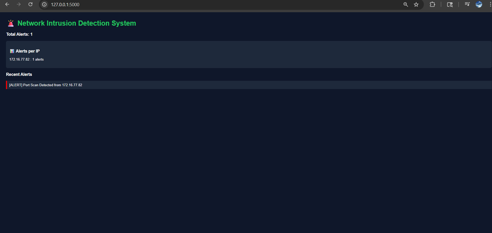

# 🚨 Network Intrusion Detection System (NIDS)

A Python-based Network Intrusion Detection System that monitors network traffic in real time and detects port scanning attacks using packet-level analysis.

---

## 📌 Overview

This project implements a rule-based intrusion detection system that captures live network packets using Scapy and analyzes behavioral patterns to identify suspicious activities such as port scanning.

A Flask-based dashboard is integrated to visualize alerts in a clean and structured format.

---

## ✨ Features

* 📡 Real-time packet sniffing using Scapy
* 🚨 Port scan detection based on behavioral analysis
* 🧠 Threshold-based anomaly detection logic
* 📊 Flask dashboard for alert visualization
* 📝 Alert logging system with optimized output control
* ⚙️ Controlled detection to reduce noise from background traffic

---

## 🛠️ Tech Stack

* Python
* Scapy
* Flask

---

## 📂 Project Structure

```
network-intrusion-detection-system/
│
├── sniffer.py        # Core detection engine
├── attacker.py       # Attack simulation script
├── app.py            # Flask dashboard
│
├── requirements.txt  # Dependencies
├── README.md         # Project documentation
├── .gitignore
│
└── assets/
    └── dashboard.png # Dashboard screenshot
```

---

## 🚀 How to Run

### 1️⃣ Install dependencies

```bash
pip install -r requirements.txt
```

---

### 2️⃣ Run the intrusion detection system

```bash
python sniffer.py
```

---

### 3️⃣ Simulate attack (for testing)

```bash
python attacker.py
```

---

### 4️⃣ Launch dashboard

```bash
python app.py
```

Open in browser:

```
http://127.0.0.1:5000
```

---

## 🧠 Detection Logic

The system monitors TCP packets and tracks the number of unique ports accessed by an IP within a defined time window.

If the number of unique ports exceeds a predefined threshold, the activity is flagged as a potential port scanning attack.

To improve usability and reduce false positives, logging is optimized to avoid redundant alerts caused by continuous background traffic.

---

## 📸 Dashboard Preview



---

## ⚠️ Challenges & Improvements

* Handling noisy real-world network traffic
* Reducing redundant alerts caused by repeated connections
* Optimizing detection logic for better accuracy and readability

---

## 🔮 Future Enhancements

* 🔐 Automatic IP blocking (Firewall integration)
* 📊 Graph-based traffic visualization
* 🤖 Machine Learning-based anomaly detection
* 🌐 Multi-attack detection (DDoS, brute-force, etc.)

---

## 👩‍💻 Author

**Anushka Dixit**

---


